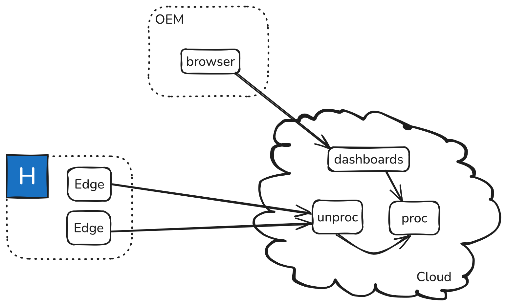
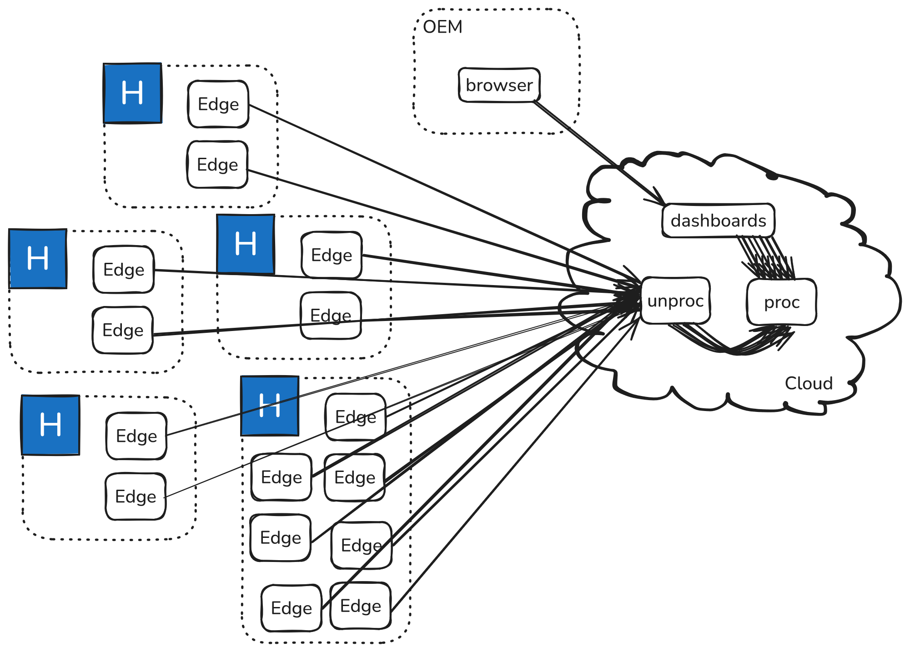
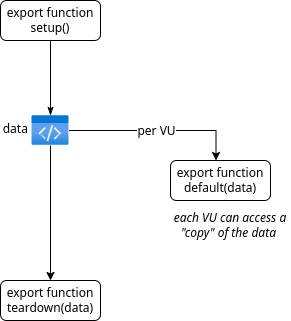
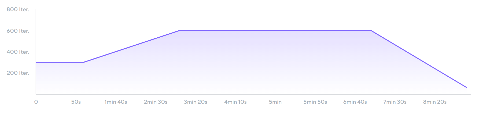
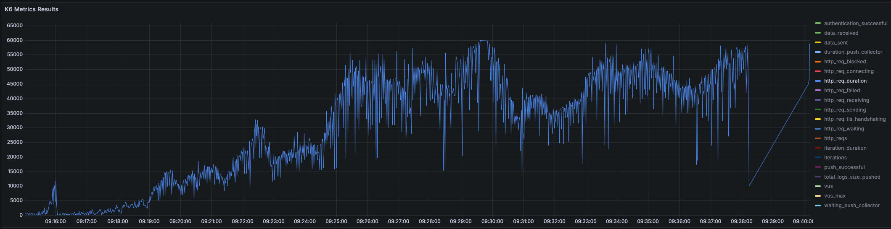
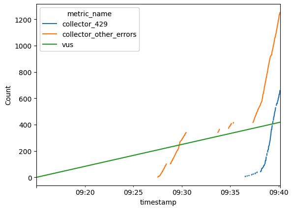

# Load Testing avec k6

---

# Le problème

* gros client signé 🎉  <!-- .element: class="fragment" -->
* tenir la charge 😱  <!-- .element: class="fragment" -->
* spoiler : non  <!-- .element: class="fragment" -->
* savoir par quoi commencer  <!-- .element: class="fragment" -->

---

# Le contexte



---



---

# Le plan

* quelle est notre archi ?  <!-- .element: class="fragment" -->
* qu'est-ce qu'on suspecte qui va péter ?  <!-- .element: class="fragment" -->
* qu'est-ce qu'on veut tester ? (fonctionnel / SLA)  <!-- .element: class="fragment" -->
* quels besoins techniques pour les tests ?  <!-- .element: class="fragment" -->
  * VMs + script de provisionnement ?  <!-- .element: class="fragment" -->
  * outil de load testing ?  <!-- .element: class="fragment" -->
  * données réalistes ?  <!-- .element: class="fragment" -->
  * débit ?  <!-- .element: class="fragment" -->
* let's go !  <!-- .element: class="fragment" -->

---

# k6

* "Grafana k6 is an open-source, developer-friendly, and extensible load testing tool."  <!-- .element: class="fragment" -->
* "k6 allows you to prevent performance issues and proactively improve reliability."  <!-- .element: class="fragment" -->
* orienté HTTP (ou browser)  <!-- .element: class="fragment" -->
* juste un binaire (Go) == installation facile  <!-- .element: class="fragment" -->
* v1.0 toute récente  <!-- .element: class="fragment" -->
* Javascript 😱 (ou TypeScript 🥸)  <!-- .element: class="fragment" -->
* exécuter une fonction en parallèle + en boucle  <!-- .element: class="fragment" -->
* stats pendant et à la fin  <!-- .element: class="fragment" -->
* pourquoi pas JMeter ? Java 🤮  <!-- .element: class="fragment" -->
* pourquoi pas Locust ? Python + perf + stats 😥  <!-- .element: class="fragment" -->
* ça semble OK  <!-- .element: class="fragment" -->

---

## Script minimal

```javascript
import http from 'k6/http';
import { sleep } from 'k6';

export const options = {
  iterations: 10,
};

export default function () {
  http.get('https://quickpizza.grafana.com');
  sleep(1);
}
```

---

```shell
$ k6 run script_minimal.js
```

[...]

```
data_received..................: 32 kB  2.8 kB/s
data_sent......................: 1.0 kB 92 B/s
http_req_blocked...............: avg=26.35ms  min=400ns    med=651ns    max=263.49ms p(90)=26.35ms  p(95)=144.92ms
http_req_connecting............: avg=10.96ms  min=0s       med=0s       max=109.69ms p(90)=10.96ms  p(95)=60.33ms
http_req_duration..............: avg=108.97ms min=107.43ms med=108.62ms max=111.04ms p(90)=110.91ms p(95)=110.98ms
  { expected_response:true }...: avg=108.97ms min=107.43ms med=108.62ms max=111.04ms p(90)=110.91ms p(95)=110.98ms
http_req_failed................: 0.00%  0 out of 10
http_req_receiving.............: avg=157.2µs  min=82.8µs   med=123.01µs max=294.46µs p(90)=274.06µs p(95)=284.26µs
http_req_sending...............: avg=376.97µs min=56.42µs  med=182.76µs max=2.03ms   p(90)=753.35µs p(95)=1.39ms
http_req_tls_handshaking.......: avg=11.14ms  min=0s       med=0s       max=111.43ms p(90)=11.14ms  p(95)=61.28ms
http_req_waiting...............: avg=108.44ms min=107.06ms med=108.27ms max=110.52ms p(90)=109.19ms p(95)=109.86ms
http_reqs......................: 10     0.879973/s
iteration_duration.............: avg=1.13s    min=1.1s     med=1.1s     max=1.37s    p(90)=1.13s    p(95)=1.25s
iterations.....................: 10     0.879973/s
vus............................: 1      min=1       max=1
vus_max........................: 1      min=1       max=1
```
<!-- .element: class="fragment" -->

---

## Cycle de vie d'un test

* init (js)  <!-- .element: class="fragment" -->
* setup (JSON)  <!-- .element: class="fragment" -->
* run  <!-- .element: class="fragment" -->
* teardown  <!-- .element: class="fragment" -->

  <!-- .element: class="fragment" -->

---

## Virtual Users (VU)

* "The simulated users that run separate and concurrent iterations of your test script."  <!-- .element: class="fragment" -->
* exécuté en parallèle (go routines)  <!-- .element: class="fragment" -->
* jouent tous le même scénario qu'on leur donne  <!-- .element: class="fragment" -->

---

## Scénarios, executors, iterations

* scénario : modélisation d'une workload (nombre de VUs au cours du temps)  <!-- .element: class="fragment" -->
* un executor se charge de scheduler les VUs pour le scenario  <!-- .element: class="fragment" -->
* open/closed model : lier durée d'itération avec durée/débit du test ?  <!-- .element: class="fragment" -->
* disponibles :  <!-- .element: class="fragment" -->
  * Shared iterations  <!-- .element: class="fragment" -->
  * Per-VU iterations  <!-- .element: class="fragment" -->
  * Constant VUs  <!-- .element: class="fragment" -->
  * Ramping VUs  <!-- .element: class="fragment" -->
  * Constant arrival rate  <!-- .element: class="fragment" -->
  * Ramping arrival rate  <!-- .element: class="fragment" -->
  * Externally controlled (REST / CLI)  <!-- .element: class="fragment" -->
* stages  <!-- .element: class="fragment" -->

---

## Ramping VUs


---

## Ramping arrival rate



---

## Metrics, checks, thresholds

* built-in (vus précédemment)  <!-- .element: class="fragment" -->
* custom :  <!-- .element: class="fragment" -->
  * counter  <!-- .element: class="fragment" -->
  * gauge  <!-- .element: class="fragment" -->
  * rate  <!-- .element: class="fragment" -->
  * trend  <!-- .element: class="fragment" -->
* real-time ou summary à la fin  <!-- .element: class="fragment" -->

---

# Mise en application

* globalement OK ✅  <!-- .element: class="fragment" -->
* quelques problèmes 😬  <!-- .element: class="fragment" -->

---

## Problème d'Executor

* Ramping VUs : simule le démarrage progressif des devices  <!-- .element: class="fragment" -->
  * mais chaque VU tabasse, ce qu'on ne veut pas  <!-- .element: class="fragment" -->
* Ramping Arrival rate : simule qu'il y a de plus en plus de requêtes  <!-- .element: class="fragment" -->
  * mais ne nous renseigne pas directement sur le nombre de devices  <!-- .element: class="fragment" -->
* solution : ramping VUs + sleeps sales !  <!-- .element: class="fragment" -->
* résultat : constant arrival rate par VU  <!-- .element: class="fragment" -->

---

## Problème de dashboard

* k6 par Grafana, référence de l'Observabilité  <!-- .element: class="fragment" -->
* plein d'intégrations real-time, mais pas dans Grafana (non-Cloud) !  <!-- .element: class="fragment" -->
* bricolage d'un dashboard, malaxage des données, ...  <!-- .element: class="fragment" -->
* on s'attendait à mieux  <!-- .element: class="fragment" -->

---

## Problème de Counter

* le code incrémente des compteurs (métriques)  <!-- .element: class="fragment" -->
* la summary à la fin est bon  <!-- .element: class="fragment" -->
* le CSV real-time contient des lignes :  <!-- .element: class="fragment" -->
  * la valeur de l'incrément, pas son cumul  <!-- .element: class="fragment" -->
* ce n'est pas un bug ("c'est une feature") : #1340  <!-- .element: class="fragment" -->
* Grafana n'est pas fait pour faire ça  <!-- .element: class="fragment" -->
* mais Pandas 🐼 si !  <!-- .element: class="fragment" -->
  * merci Python 💪🐍  <!-- .element: class="fragment" -->

---

## Résultat final

* script de ~330 lignes  <!-- .element: class="fragment" -->
* config par type de device à simuler  <!-- .element: class="fragment" -->
* calcul du débit utile qui sera simulé  <!-- .element: class="fragment" -->
* setup des données de test en JSON  <!-- .element: class="fragment" -->
* chaque VU simule un device edge :  <!-- .element: class="fragment" -->
  * mapping VU <--> device à base de "testId"  <!-- .element: class="fragment" -->
  * authentification (config)  <!-- .element: class="fragment" -->
  * préparation de la requête (config) et envoi  <!-- .element: class="fragment" -->
  * sleep pour attendre un peu (config)  <!-- .element: class="fragment" -->
  * update des métriques custom (429, erreurs, charge utile totale, ...)  <!-- .element: class="fragment" -->
* super résultat au final !

---

## On veut voir du code !

```javascript
export function setup() {
  "use strict";
  const payloadSendRateBySecondByDevice = config.singleLogLineSize * config.numberLogsLineByPush / config.secondsBetweenEachPush;
  const payloadSendRateBySecondTotal = payloadSendRateBySecondByDevice * config.numberDevicesToSimulate;
  console.log("estimated payload rate = " + payloadSendRateBySecondTotal/1000 + "Ko/s total");
  console.log("estimated payload rate = " + payloadSendRateBySecondTotal/1000000*3600 + "Mo/h total");

  let vusState = {};
  for (let i = 0; i < config.numberDevicesToSimulate; i++) {
    vusState[(i+1).toString()] = {
      // MUST BE STRICTLY JSON-SERIALIZABLE, SO ONLY NUMBERS/STRINGS/NULLS
      last_log_line_count: -1,
      deviceId: generateDeviceId(),
      lastSuccessfulAuthentication: null,
      authenticationDetails: null,
    };
  }
  return vusState;
}
```

---

```javascript
export default function (vusState) {
  "use strict";
  let vuId = exec.vu.idInTest;
  let vuState = vusState[vuId.toString()];
  if (!vuState.lastSuccessfulAuthentication) {
    tryToAuthenticate(vuState);
  } else {
    sendLogs(vuState);
  }
}
```

---

```javascript
let authenticationSuccessfulCounter = new Counter("authentication_successful");
let authenticationFailedCounter     = new Counter("authentication_failed");
let pushSuccessfulCounter           = new Counter("push_successful");
let pushFailed429Counter            = new Counter("collector_429");
let pushFailedOtherErrorsCounter    = new Counter("collector_other_errors");
let totalLogsSizePushedCounter      = new Counter("total_logs_size_pushed");
let durationPushToCollectorTrend  = new Trend("duration_push_collector");
let durationWaitingCollectorTrend = new Trend("waiting_push_collector");
```

---

```javascript
function sendLogs(vuState) {
    "use strict";
    if (vuState.lastPushDatetime) {
        const currentDatetime = new Date();
        const elapsedTimeSinceLastPush = (currentDatetime - new Date(vuState.lastPushDatetime)) / 1000;  // re-hydrate the date
        if (elapsedTimeSinceLastPush < config.secondsBetweenEachPush) {
            sleep(0.1);
        }
    }
    let body = JSON.stringify({...});
    let headers = {...};
    let response = http.post(pushUrl, body, headers);
    durationWaitingCollectorTrend.add(response.timings.waiting);
    durationPushToCollectorTrend.add(response.timings.duration);
    // ...
```

---
  
```javascript
    // ...
    if (response.status === 429) {
        pushFailed429Counter.add(1);
    } else if (response.status === 200) {
        pushSuccessfulCounter.add(1);
        totalLogsSizePushedCounter.add(config.singleLogLineSize * config.numberLogsLineByPush);
    } else {
        pushFailedOtherErrorsCounter.add(1);
    }
    vuState.lastPushDatetime = new Date();
}
```

---

## Déploiment

* simuler 500 devices ==> 500 connexions TCP  <!-- .element: class="fragment" -->
* j'ai pas 500 ordinateurs à travers le monde, mais Microsoft oui  <!-- .element: class="fragment" -->
* création d'une VM manuelle, template, az-cli  <!-- .element: class="fragment" -->
* il faut pourvoir se SSH dessus ==> network + bastion  <!-- .element: class="fragment" -->
* network group sec pénibles  <!-- .element: class="fragment" -->
* bastion cher + pas d'outbound  <!-- .element: class="fragment" -->
* IPv4 en nombre limité ==> NAT requis  <!-- .element: class="fragment" -->
* IPv6 pas supporté au niveau du NAT  <!-- .element: class="fragment" -->
* finalement on a payé pour avoir + d'IPv4  <!-- .element: class="fragment" -->
* mais on n'aura pas 500 connections TCP  <!-- .element: class="fragment" -->

---

# Résultats

* on lance, plein d'erreurs de config  <!-- .element: class="fragment" -->
* on relance, on commence à avoir des résultats
* on re-relance, après avoir modifié quelques trucs faciles
* on analyse

---

<!-- .slide: data-background-image="results_full_dashboard.png" -->

---



---



---

## Sources

* moi
* [la doc bien foutue de Grafana k6](https://grafana.com/docs/k6/)
  * [breakpoint testing](https://grafana.com/docs/k6/latest/testing-guides/test-types/breakpoint-testing/)
  * [JavaScript compatibility mode](https://grafana.com/docs/k6/latest/using-k6/javascript-typescript-compatibility-mode/)

---

# Questions ?

* n'oubliez pas le ROTI à la fin
